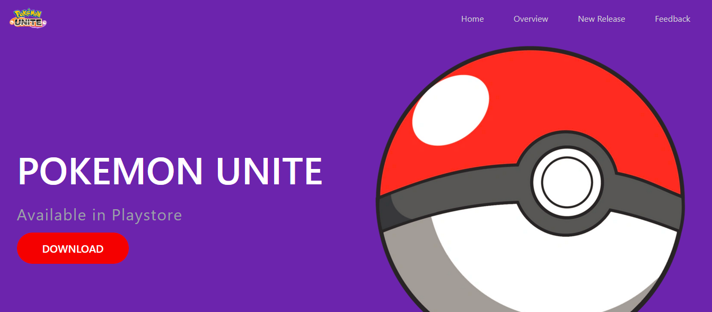

# Pokémon Unite



Welcome to the Pokémon Unite website! Our goal is to promote the game and bring players together by providing a central hub for information, resources, and fun content about Pokémon Unite. Whether you're a new player or a seasoned gamer, our website aims to be your go-to source for everything you need to know about this exciting multiplayer game. We also strive to build a strong community where players can connect, share strategies, and stay updated on the latest news. Our ultimate objective is to contribute to the success and enjoyment of Pokémon Unite by creating a space where fans can come together, learn, and have a great time playing the game.

This application is built using Tailwind CSS, and React JS. 

## Getting Started

To get a local copy up and running, follow these steps. 

### Prerequisites

Before you begin, ensure you have installed the latest version of:

- Node.js and npm
- Git

### Installation

1. Clone the repository:
   ```bash
   git clone (https://github.com/prince-bojji/pokemon-unite.git)

2. Navigate to the project directory:
   ```bash
    cd pokemon-unite
3. Install the project dependencies:
   ```bash
    npm install
5. Start the development server:
   ```bash
    npm start

Now you should be able to see the project running at localhost:3000. 

## Contributing

We welcome contributions from everyone. If you're interested in improving the project, please follow the steps below:

1. Fork the Project
2. Create your Feature Branch (`git checkout -b feature/YourFeature`)
3. Commit your Changes (`git commit -m 'Add some feature'`)
4. Push to the Branch (`git push origin feature/YourFeature`)
5. Open a Pull Request
